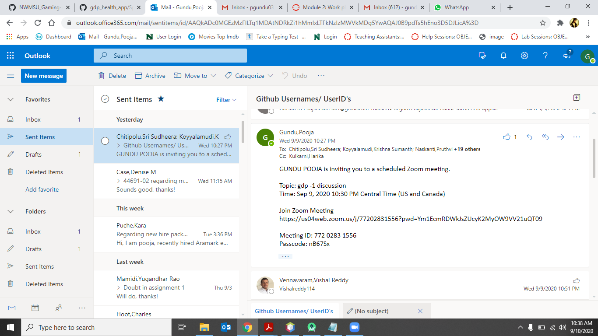
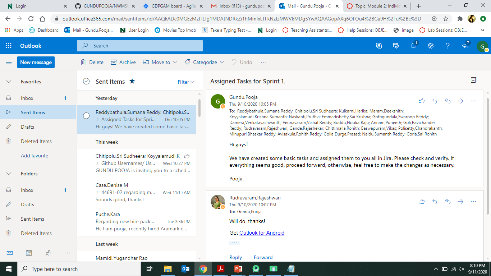

# Gundu Pooja - Section 02 - Dr.Denise Case

## Team Progress Report - Module 2 Individual 1 Contribution

- Project Name: Gaming app
- Name: Pooja Gundu
- 919: 919587319
- SID: s538295

1. Attendance (class periods I attended )
• 09-07-2020 – Paid leave
• 09-09-2020 – zoom session
• 09-11-2020 – zoom session
• For attendance I think I earned 200 points.

2. Half-day 1
This day was a paid leave

3. Half-day 2
Time allotted: 4 hours = 1 hour in-class + 3 hours out of the class = worth 300 points
- Since communication is very important between the teams as we progress in our project,
- I spent most of my time reaching out to my team members and discussed the things how we should proceed further.
- I have accepted the invitation to the repo created by stories and sprint planning team,this repo will be common to every team.
- Github repo link: https://github.com/GUNDUPOOJA/NWMSU_Gaming-App  and also the 
- NWjira link :cs04.nwmissouri.edu/secure/RapidBoard.jspa?rapidView=4&projectKey=GDPGAM
- I scheduled a zoom meeting and send the invitation to all the team members through outlook, there we discussed and share the ideas on what tasks we should do.

 
4. Half-day 3
- Time allotted: 4 hours = 1 hour in-class + 3 hours out of the class = worth 300 points
- After accepting the invitation for the NW Jira account, as a member of the stories and sprint planning team, I assigned some basic tasks to everyone in the design UI/team.
- Some of the tasks which I have given are creating UI sketches and reviewing them with the client, updating those sketches based on client feedback.
- Here are the links for tasks/stories :
- http://cs04.nwmissouri.edu/browse/GDPGAM-30
- http://cs04.nwmissouri.edu/browse/GDPGAM-32 
- http://cs04.nwmissouri.edu/browse/GDPGAM-33
- http://cs04.nwmissouri.edu/browse/GDPGAM-34 
- http://cs04.nwmissouri.edu/browse/GDPGAM-35 
- http://cs04.nwmissouri.edu/browse/GDPGAM-36 
- http://cs04.nwmissouri.edu/browse/GDPGAM-37 
- http://cs04.nwmissouri.edu/browse/GDPGAM-38 
- After creating the tasks I have sent an email to everyone stating to verify them and also to create new tasks if necessary.

 
